# ⚔️ Kompendium Recept i Drzewek Recombinera (Przedmioty LoL w Championie)

Ten dokument zawiera zestawienie wszystkich drzewek wytwarzania przedmiotów w **Recombinerze**, ich recepty, koszty złota, ID przedmiotów oraz szczegółowy opis statystyk (**implicits**) i unikalnych pasywek dla każdego przedmiotu końcowego.

---

## 📦 Składniki Bazowe (Base Items)

| Przedmiot Bazowy | Item ID | Podstawowa Rola |
| :--- | :--- | :--- |
| **Bronze Axe** | `26618` | Fizyczny atak bazowy |
| **Dagger** | `36676` | Szybkość ataku / Szansa na krytyk |
| **Druid Rod** | `26445` | Magiczny atak bazowy |
| **Icy Wand** | `2184` | Różdżka lodu |
| **Amplifying Tome** | `1955` | Tom magii |
| **Druid Cape** | `26442` | Obrona magiczna bazowa |
| **Bronze Armor** | `26393` | Pancerz fizyczny bazowy |
| **Elven Plate** *(Ruby Crystal)* | `26491` | Zdrowie bazowe (+150 HP) |
| **Monocle** *(Glowing Mote)* | `7900` | CDR / Mana bazowa |
| **Recovery Ring** | `38860` | Regeneracja zdrowia |
| **Lifestealer Ring** | `26832` | Kradzież życia (Lifesteal) |
| **Pickaxe** | `4874` | Fizyczny atak średni |
| **Boots** | `26438` | Bazowa prędkość poruszania się |

---

## 👑 Drzewka Przedmiotów Legendarnych (Legendary Trees)

```mermaid
graph TD
    classDef legend fill:#f96,stroke:#333,stroke-width:2px;
    classDef comp fill:#69f,stroke:#333,stroke-width:1px;

    %% Rabadon
    DR1["2x Druid Rod (26445)"] -->|500g| DW["Dragon Wand (2191)"]
    DW & IW["Icy Wand (2184)"] -->|1500g| EW["Eclipse Wand (8920)"]
    EW & EW2["Eclipse Wand (8920)"] -->|5000g| Rab["Rabadon's Deathcap (8820)"]:::legend

    %% Void Staff
    Tome["Amplifying Tome (1955)"] -->|700g| BJ["Blighting Jewel (2178)"]
    DR2["2x Druid Rod (26445)"] -->|500g| BW["Blasting Wand (2189)"]
    BJ & BW -->|2000g| VS["Void Staff (7424)"]:::legend

    %% Bloodthirster
    BA1["2x Bronze Axe (26618)"] -->|500g| BFS["B. F. Sword (2393)"]
    BA2["Bronze Axe (26618)"] & LR["Lifestealer Ring (26832)"] -->|500g| VScep["Vampiric Scepter (2424)"]
    BFS & VScep & Pick1["Pickaxe (4874)"] -->|1000g| BT["Bloodthirster (7416)"]:::legend

    %% Infinity Edge
    Dag1["2x Dagger (36676)"] -->|300g| CoA["Cloak of Agility (2660)"]
    BFS2["B. F. Sword (2393)"] & Pick2["Pickaxe (4874)"] & CoA -->|1000g| IE["Infinity Edge (7417)"]:::legend

    %% Black Cleaver
    BA3["Bronze Axe (26618)"] & EP1["Elven Plate (26491)"] -->|350g| Phage["Phage (7415)"]
    EP2["Elven Plate (26491)"] & Mon1["Monocle (7900)"] -->|500g| Kind["Kindlegem (38641)"]
    Phage & Kind & Pick3["Pickaxe (4874)"] -->|1000g| BC["Black Cleaver (7419)"]:::legend

    %% Trinity Force
    Mon2["Monocle (7900)"] -->|650g| Sheen["Sheen (7418)"]
    BA4["2x Bronze Axe (26618)"] & Dag2["Dagger (36676)"] -->|250g| HA["Hearthbound Axe (7411)"]
    Sheen & Phage2["Phage (7415)"] & HA -->|133g| TF["Trinity Force (8927)"]:::legend

    %% Wit's End
    Dag3["Dagger (36676)"] -->|450g| Rec1["Recurve Bow (8855)"]
    DC1["2x Druid Cape (26442)"] -->|500g| Neg1["Negatron Cloak (8870)"]
    Rec1 & Rec2["Recurve Bow (8855)"] & Neg1 -->|550g| WE["Wit's End (7407)"]:::legend

    %% Nashor's Tooth
    Tome2["Amplifying Tome (1955)"] & Mon3["Monocle (7900)"] -->|200g| FC["Fiendish Codex (8902)"]
    Rec3["Recurve Bow (8855)"] & BW2["Blasting Wand (2189)"] & FC -->|500g| NT["Nashor's Tooth (7408)"]:::legend

    %% BotRK
    VScep2["Vampiric Scepter (2424)"] & Rec4["Recurve Bow (8855)"] & Pick4["Pickaxe (4874)"] -->|725g| BotRK["Blade of the Ruined King (7405)"]:::legend

    %% Thornmail
    BArm1["Bronze Armor (26393)"] -->|500g| CV["Chain Vest (2464)"]
    BArm2["2x Bronze Armor (26393)"] -->|200g| BV["Bramble Vest (2483)"]
    BV & CV & EP3["Elven Plate (26491)"] -->|450g| TM["Thornmail (8882)"]:::legend

    %% Sunfire Aegis
    EP4["Elven Plate (26491)"] & Mon4["Monocle (7900)"] -->|250g| Bami["Bami's Cinder (2156)"]
    Bami & CV2["Chain Vest (2464)"] & EP5["Elven Plate (26491)"] -->|700g| SA["Sunfire Aegis (8881)"]:::legend
```

---

### 1. 🔮 MAGE AP TREE — **Rabadon's Deathcap**
* **Krok 1:** `2x Druid Rod (26445) + 500 Gold` $\rightarrow$ **Dragon Wand (2191)** `[+20 Magic Attack]`
* **Krok 2:** `Dragon Wand (2191) + Icy Wand (2184) + 1500 Gold` $\rightarrow$ **Eclipse Wand (8920)** `[+45 Magic Attack]`
* **Krok 3 (Finał):** `2x Eclipse Wand (8920) + 5000 Gold` $\rightarrow$ **Rabadon's Deathcap (8820)**
  * **Implicits Przedmiotu Końcowego:**
    * `+100 Magic Attack` *(ID 7)*
    * `+300 Mana` *(ID 2)*
    * **UNIQUE - Magical Opus** *(ID 30)*: Zwiększa całkowity Magic Attack postaci o **+30%**.

---

### 2. 🛡️ TANK MAGIC RESIST TREE — **Abyssal Mask**
* **Krok 1:** `2x Druid Cape (26442) + 500 Gold` $\rightarrow$ **Negatron Cloak (8870)** `[+25 Magic Defense]`
* **Krok 2:** `Elven Plate (26491) + Monocle (7900) + 500 Gold` $\rightarrow$ **Kindlegem (38641)** `[+200 Health, +10% CDR]`
* **Krok 3 (Finał):** `Kindlegem (38641) + Negatron Cloak (8870) + 2500 Gold` $\rightarrow$ **Abyssal Mask (9778)**
  * **Implicits Przedmiotu Końcowego:**
    * `+300 Health` *(ID 1)*
    * `+45 Magic Defense` *(ID 9)*
    * `+15% Cooldown Reduction` *(ID 16)*
    * **UNIQUE - Unmake** *(ID 29)*: Zmniejsza obronę magiczną wszystkich pobliskich wrogów o **-30%**.

---

### 3. 🌌 MAGE PENETRATION TREE — **Void Staff**
* **Krok 1:** `Amplifying Tome (1955) + 700 Gold` $\rightarrow$ **Blighting Jewel (2178)** `[+20 Magic Attack, +15 Magic Penetration]`
* **Krok 2:** `2x Druid Rod (26445) + 500 Gold` $\rightarrow$ **Blasting Wand (2189)** `[+30 Magic Attack]`
* **Krok 3 (Finał):** `Blighting Jewel (2178) + Blasting Wand (2189) + 2000 Gold` $\rightarrow$ **Void Staff (7424)**
  * **Implicits Przedmiotu Końcowego:**
    * `+95 Magic Attack` *(ID 7)*
    * `+40 Magic Penetration` *(ID 15)*

---

### 4. 🪓 PHYSICAL BRUISER TREE — **Black Cleaver**
* **Krok 1a:** `Bronze Axe (26618) + Elven Plate (26491) + 350 Gold` $\rightarrow$ **Phage (7415)** `[+15 Physical Attack, +200 Health]`
* **Krok 1b:** `Elven Plate (26491) + Monocle (7900) + 500 Gold` $\rightarrow$ **Kindlegem (38641)** `[+200 Health, +10% CDR]`
* **Krok 2 (Finał):** `Phage (7415) + Kindlegem (38641) + Pickaxe (4874) + 1000 Gold` $\rightarrow$ **Black Cleaver (7419)**
  * **Implicits Przedmiotu Końcowego:**
    * `+40 Physical Attack` *(ID 6)*
    * `+20% Cooldown Reduction` *(ID 16)*
    * `+400 Health` *(ID 1)*
    * **UNIQUE - Carve & Fervor** *(ID 31)*: Ataki i umiejętności rozrywają pancerz celu do **-30%** i dają bonusowy **Movement Speed**.

---

### 5. 🩸 PHYSICAL LIFESTEAL TREE — **Bloodthirster**
* **Krok 1a:** `2x Bronze Axe (26618) + 500 Gold` $\rightarrow$ **B. F. Sword (2393)** `[+40 Physical Attack]`
* **Krok 1b:** `Bronze Axe (26618) + Lifestealer Ring (26832) + 500 Gold` $\rightarrow$ **Vampiric Scepter (2424)** `[+15 Physical Attack, +8% Physical Lifesteal]`
* **Krok 2 (Finał):** `B. F. Sword (2393) + Vampiric Scepter (2424) + Pickaxe (4874) + 1000 Gold` $\rightarrow$ **Bloodthirster (7416)**
  * **Implicits Przedmiotu Końcowego:**
    * `+80 Physical Attack` *(ID 6)*
    * `+15% Physical Lifesteal` *(ID 17)*
    * **UNIQUE - Ichor Shield** *(ID 32)*: Nadmiar leczenia z lifesteala tworzy tarczę ochronną (do 10% Max HP).

---

### 6. 🗡️ CRITICAL STRIKE TREE — **Infinity Edge**
* **Krok 1:** `2x Dagger (36676) + 300 Gold` $\rightarrow$ **Cloak of Agility (2660)** `[+15% Critical Chance]`
* **Krok 2 (Finał):** `B. F. Sword (2393) + Pickaxe (4874) + Cloak of Agility (2660) + 1000 Gold` $\rightarrow$ **Infinity Edge (7417)**
  * **Implicits Przedmiotu Końcowego:**
    * `+70 Physical Attack` *(ID 6)*
    * `+25% Critical Chance` *(ID 12)*
    * `+40% Critical Damage` *(ID 13)*

---

### 7. 💖 TANK VITALITY TREE — **Warmog's Armor**
* **Krok 1:** `2x Elven Plate (26491) + 500 Gold` $\rightarrow$ **Giant's Belt (2487)** `[+350 Health]`
* **Krok 2:** `Elven Plate (26491) + Boots (26438) + 400 Gold` $\rightarrow$ **Winged Moonplate (2486)** `[+150 Health, +4% Movement Speed]`
* **Krok 3:** `Elven Plate (26491) + Recovery Ring (38860) + 100 Gold` $\rightarrow$ **Crystalline Bracer (2469)** `[+200 Health, +5 Health Regen]`
* **Krok 4 (Finał):** `Giant's Belt (2487) + Winged Moonplate (2486) + Crystalline Bracer (2469) + 800 Gold` $\rightarrow$ **Warmog's Armor (8878)**
  * **Implicits Przedmiotu Końcowego:**
    * `+1000 Health` *(ID 1)*
    * `+15 Health Regeneration` *(ID 4)*
    * `+5% Movement Speed` *(ID 10)*
    * **UNIQUE - Warmog's Heart** *(ID 33)*: Regeneruje **3% Max HP na sekundę**.

---

### 8. ⚡ LEGENDARY TRINITY TREE — **Trinity Force**
* **Krok 1:** `Monocle (7900) + 650 Gold` $\rightarrow$ **Sheen (7418)** `[+10% CDR, [34] Spellblade: +100% Base AD on-hit]`
* **Krok 2:** `2x Bronze Axe (26618) + Dagger (36676) + 250 Gold` $\rightarrow$ **Hearthbound Axe (7411)** `[+20 Physical Attack, +12% Attack Speed, [35] Quicken: +20 MS on-hit]`
* **Krok 3 (Finał):** `Sheen (7418) + Phage (7415) + Hearthbound Axe (7411) + 133 Gold` $\rightarrow$ **Trinity Force (8927)**
  * **Implicits Przedmiotu Końcowego:**
    * `+36 Physical Attack` *(ID 6)*
    * `+15% Cooldown Reduction` *(ID 16)*
    * `+30% Attack Speed` *(ID 11)*
    * `+333 Health` *(ID 1)*
    * **UNIQUE - Spellblade** *(ID 34)*: Następny atak po rzuceniu czaru zadaje **+200% Base AD** bonusowych obrażeń fizycznych.
    * **UNIQUE - Quicken** *(ID 35)*: Atak podstawowy dodaje **+20 Movement Speed** na 2 sekundy.

---

### 9. 🟣 ON-HIT ATTACK SPEED / MAGIC RESIST — **Wit's End**
* **Krok 1:** `Dagger (36676) + 450 Gold` $\rightarrow$ **Recurve Bow (8855)** `[+15% Attack Speed, [36] Fray: +15 Magic Dmg on-hit]`
* **Krok 2 (Finał):** `2x Recurve Bow (8855) + Negatron Cloak (8870) + 550 Gold` $\rightarrow$ **Wit's End (7407)**
  * **Implicits Przedmiotu Końcowego:**
    * `+45 Magic Defense` *(ID 9)*
    * `+50% Attack Speed` *(ID 11)*
    * `+300 Health` *(ID 1)*
    * **UNIQUE - Fray** *(ID 36)*: Podstawowe ataki zadają **+45 obrażeń magicznych on-hit**.

---

### 10. 🦷 AP ON-HIT ATTACK SPEED — **Nashor's Tooth**
* **Krok 1:** `Amplifying Tome (1955) + Monocle (7900) + 200 Gold` $\rightarrow$ **Fiendish Codex (8902)** `[+25 Magic Attack, +10% CDR]`
* **Krok 2 (Finał):** `Recurve Bow (8855) + Blasting Wand (2189) + Fiendish Codex (8902) + 500 Gold` $\rightarrow$ **Nashor's Tooth (7408)**
  * **Implicits Przedmiotu Końcowego:**
    * `+80 Magic Attack` *(ID 7)*
    * `+15% Cooldown Reduction` *(ID 16)*
    * `+50% Attack Speed` *(ID 11)*
    * **UNIQUE - Icathian Bite** *(ID 37)*: Podstawowe ataki zadają **15 (+15% Magic Attack)** dodatkowych obrażeń magicznych on-hit.

---

### 11. 🗡️ PHYSICAL ON-HIT LIFESTEAL — **Blade of the Ruined King**
* **Krok 1 (Finał):** `Vampiric Scepter (2424) + Recurve Bow (8855) + Pickaxe (4874) + 725 Gold` $\rightarrow$ **Blade of the Ruined King (7405)**
  * **Implicits Przedmiotu Końcowego:**
    * `+40 Physical Attack` *(ID 6)*
    * `+25% Attack Speed` *(ID 11)*
    * `+10% Physical Lifesteal` *(ID 17)*
    * **UNIQUE - Mist's Edge** *(ID 38)*: Podstawowe ataki zadają **9% (melee) / 6% (ranged)** aktualnego zdrowia celu (*Current HP*) jako obrażenia fizyczne on-hit.

---

### 12. 🌵 TANK PHYSICAL DEFENSE / REFLECT — **Thornmail**
* **Krok 1:** `Bronze Armor (26393) + 500 Gold` $\rightarrow$ **Chain Vest (2464)** `[+40 Physical Defense]`
* **Krok 2:** `2x Bronze Armor (26393) + 200 Gold` $\rightarrow$ **Bramble Vest (2483)** `[+30 Physical Defense, [39] Thorns: 6 (+10% Armor) Magic Reflect]`
* **Krok 3 (Finał):** `Bramble Vest (2483) + Chain Vest (2464) + Elven Plate (26491) + 450 Gold` $\rightarrow$ **Thornmail (8882)**
  * **Implicits Przedmiotu Końcowego:**
    * `+75 Physical Defense` *(ID 8)*
    * `+150 Health` *(ID 1)*
    * **UNIQUE - Thorns** *(ID 39)*: Po otrzymaniu ataku podstawowego odbija **20 (+10% Physical Defense)** obrażeń magicznych w napastnika.

---

### 13. 🔥 TANK HEALTH / AOE RETALIATION — **Sunfire Aegis**
* **Krok 1:** `Elven Plate (26491) + Monocle (7900) + 250 Gold` $\rightarrow$ **Bami's Cinder (2156)** `[+200 Health, +5% CDR, [40] Immolate: 10 (+0.5% Max HP) AoE Magic Dmg]`
* **Krok 2 (Finał):** `Bami's Cinder (2156) + Chain Vest (2464) + Elven Plate (26491) + 700 Gold` $\rightarrow$ **Sunfire Aegis (8881)**
  * **Implicits Przedmiotu Końcowego:**
    * `+350 Health` *(ID 1)*
    * `+50 Physical Defense` *(ID 8)*
    * `+10% Cooldown Reduction` *(ID 16)*
    * **UNIQUE - Immolate** *(ID 40)*: Za każde otrzymane obrażenia gracz wywołuje falę ognia zadającą **20 (+1% Max HP)** obrażeń magicznych wszystkim wrogom w promieniu 2 kratek.

---

### 14. 🌿 TANK MAGIC RESIST & VITALITY — **Spirit Visage**
* **Krok 1:** `Elven Plate (26491) + Druid Cape (26442) + Recovery Ring (38860) + 150 Gold` $\rightarrow$ **Spectre's Cowl (8871)** `[+250 Health, +25 Magic Defense, +5 Health Regen]`
* **Krok 2 (Finał):** `Spectre's Cowl (8871) + Kindlegem (38641) + 650 Gold` $\rightarrow$ **Spirit Visage (8880)**
  * **Implicits Przedmiotu Końcowego:**
    * `+400 Health` *(ID 1)*
    * `+50 Magic Defense` *(ID 9)*
    * `+10% Cooldown Reduction` *(ID 16)*
    * `+10 Health Regeneration` *(ID 4)*
    * **UNIQUE - Boundless Vitality** *(ID 43)*: Zwiększa wszelkie otrzymywane leczenie, kradzież życia (lifesteal), tarcze oraz regenerację zdrowia o **+25%**.

---

### 15. 🔥 MAGE BRUISER / BURN — **Liandry's Torment**
* **Krok 1 (Finał):** `Blasting Wand (2189) + Giant's Belt (2487) + Magicvamp Amulet (26833) + 800 Gold` $\rightarrow$ **Liandry's Torment (2501)**
  * **Implicits Przedmiotu Końcowego:**
    * `+50 Magic Attack` *(ID 7)*
    * `+400 Health` *(ID 1)*
    * `+15% Magic Lifesteal` *(ID 18)*
    * **UNIQUE - Torment** *(ID 44)*: Umiejętności i ataki podpalają cel na 4 sekundy, zadając **1% Max HP celu co sekundę** jako obrażenia magiczne/ogniste.

---

### 16. ⏳ MAGE ARMOR / TIME STOP — **Zhonya's Hourglass**
* **Krok 1:** `2x Amplifying Tome (1955) + Bronze Armor (26393) + 500 Gold` $\rightarrow$ **Seeker's Armguard (20133)** `[+30 Magic Attack, +20 Physical Defense]`
* **Krok 2 (Finał):** `Seeker's Armguard (20133) + Eclipse Wand (8920) + 450 Gold` $\rightarrow$ **Zhonya's Hourglass (20002)**
  * **Implicits Przedmiotu Końcowego:**
    * `+105 Magic Attack` *(ID 7)*
    * `+50 Physical Defense` *(ID 8)*
    * **UNIQUE - Time Stop** *(ID 45)*: Przy spadku zdrowia poniżej 30% HP lub ciosie śmiertelnym aktywuje **Nieśmiertelność (IMMORTAL) na 3 sekundy** (Czas odnowienia: 120 sekund).

---

### 17. 🛡️ MAGE MAGIC RESIST / SPELL SHIELD — **Banshee's Veil**
* **Krok 1:** `2x Amplifying Tome (1955) + Druid Cape (26442) + 400 Gold` $\rightarrow$ **Verdant Barrier (2180)** `[+30 Magic Attack, +20 Magic Defense]`
* **Krok 2 (Finał):** `Verdant Barrier (2180) + Eclipse Wand (8920) + 200 Gold` $\rightarrow$ **Banshee's Veil (2174)**
  * **Implicits Przedmiotu Końcowego:**
    * `+105 Magic Attack` *(ID 7)*
    * `+40 Magic Defense` *(ID 9)*
    * **UNIQUE - Annul** *(ID 46)*: Daje widoczny buff **Spell Shield (Tarcza Umiejętności)**, który całkowicie blokuje następną wrogą umiejętność lub zaklęcie (Czas odnowienia: 40 sekund).

---

### 18. 🏹 PHYSICAL PENETRATION & ANTI-HEAL — **Mortal Reminder**
* **Krok 1:** `Bronze Axe (26618) + 450 Gold` $\rightarrow$ **Executioner's Calling (7404)** `[+15 Physical Attack, [47] Grievous Wounds: -40% Healing]`
* **Krok 2:** `2x Bronze Axe (26618) + 750 Gold` $\rightarrow$ **Last Whisper (8856)** `[+20 Physical Attack, +18 Physical Penetration]`
* **Krok 3 (Finał):** `Executioner's Calling (7404) + Last Whisper (8856) + Cloak of Agility (2660) + 350 Gold` $\rightarrow$ **Mortal Reminder (8857)**
  * **Implicits Przedmiotu Końcowego:**
    * `+35 Physical Attack` *(ID 6)*
    * `+30 Physical Penetration` *(ID 14)*
    * `+25% Critical Chance` *(ID 12)*
    * **UNIQUE - Grievous Wounds** *(ID 47)*: Zadanie obrażeń fizycznych nakłada na cel debuff **Grievous Wounds (Głębokie Rany)** na 3 sekundy, redukując wszelkie otrzymywane przez niego leczenie i regenerację zdrowia o **40%**.

---

### 19. 📖 MAGE GRIEVOUS WOUNDS & HEALTH — **Morellonomicon**
* **Krok 1:** `Amplifying Tome (1955) + 400 Gold` $\rightarrow$ **Oblivion Orb (2176)** `[+25 Magic Attack, [48] Cursed Touch: -40% Healing]`
* **Krok 2 (Finał):** `Oblivion Orb (2176) + Blasting Wand (2189) + Kindlegem (38641) + 500 Gold` $\rightarrow$ **Morellonomicon (8903)**
  * **Implicits Przedmiotu Końcowego:**
    * `+75 Magic Attack` *(ID 7)*
    * `+15% Cooldown Reduction` *(ID 16)*
    * `+350 Health` *(ID 1)*
    * **UNIQUE - Cursed Touch** *(ID 48)*: Zadanie obrażeń magicznych nakłada na cel debuff **Grievous Wounds (Głębokie Rany)** na 3 sekundy, redukując wszelkie otrzymywane przez niego leczenie i regenerację zdrowia o **40%**.

---

## 👢 Ulepszone Buty (Upgraded Boots)

Wszystkie recepty ulepszenia butów wymagają **500 Gold**:

| Buty | Składniki w Recombinerze | Złoto | Implicits Przedmiotu Końcowego |
| :--- | :--- | :--- | :--- |
| **Berserker's Greaves** (`2646`) | `Boots (26438) + 2x Dagger (36676)` | **500** | `+45 Movement Speed` *(ID 21)* `+30% Attack Speed` *(ID 11)* |
| **Plated Steelcaps** (`2645`) | `Boots (26438) + Bronze Armor (26393)` | **500** | `+45 Movement Speed` *(ID 21)* `+25 Physical Defense` *(ID 8)* **[41] Plating**: Redukuje otrzymywane obrażenia z podstawowych ataków o **10%** |
| **Boots of Swiftness** (`2195`) | `2x Boots (26438)` | **500** | `+55 Movement Speed` *(ID 21)* `+5% Movement Speed` *(ID 10)* **[42] Fleetfooted**: Zwiększona prędkość oraz odporność na spowolnienia |
| **Ionian Boots of Lucidity** (`2640`) | `Boots (26438) + Monocle (7900)` | **500** | `+45 Movement Speed` *(ID 21)* `+10% Cooldown Reduction` *(ID 16)* |
| **Sorcerer's Shoes** (`7893`) | `Boots (26438) + Amplifying Tome (1955)` | **500** | `+45 Movement Speed` *(ID 21)* `+15 Magic Penetration` *(ID 15)* |

